<div align="center">

<picture>
  <source srcset="assets/banner.svg" media="(prefers-color-scheme: dark)"/>
  <source srcset="assets/banner-light.svg" media="(prefers-color-scheme: light)"/>
  
</picture>

</div>

<br>

<div align="center">

<sub>Welcome to my world of code, creativity, and continuous learning.</sub>

</div>

<br>

```ts
const developer = {
  name: "Aliyan Amjad Khan",
  role: ["Full Stack Developer", "Software Engineer"],
  stack: {
    languages: ["JavaScript", "Python", "HTML", "CSS"],
    frameworks: ["React", "Node.js", "Flask", "Flutter"],
    into: "MERN Stack",
  },
  philosophy: "ship it, then make it better",
  find_me: {
    portfolio: "aliyanamjadkhan.netlify.app",
    linkedin: "linkedin.com/in/aliyanamjadkhan",
  },
};
```

<br>

<div align="center">

<picture>
  <source srcset="assets/skills.svg" media="(prefers-color-scheme: dark)"/>
  <source srcset="assets/skills-light.svg" media="(prefers-color-scheme: light)"/>
  
</picture>

</div>

<br>

<div align="center">
<table>
<tr>
<td width="50%">

</td>
<td width="50%">

</td>
</tr>
</table>


</div>

<br>

<div align="center">

<a href="https://aliyanamjadkhan.netlify.app">portfolio</a> &nbsp;&#183;&nbsp; <a href="https://www.linkedin.com/in/aliyanamjadkhan">linkedin</a>

<br><br>

<picture>
  <source srcset="assets/footer.svg" media="(prefers-color-scheme: dark)"/>
  <source srcset="assets/footer-light.svg" media="(prefers-color-scheme: light)"/>
  
</picture>

</div>
